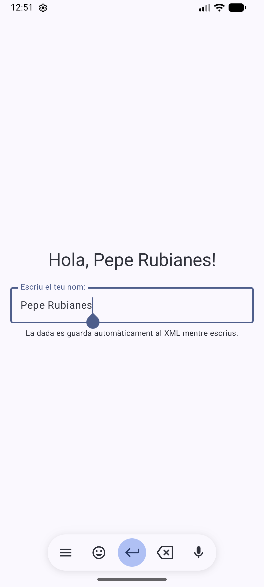
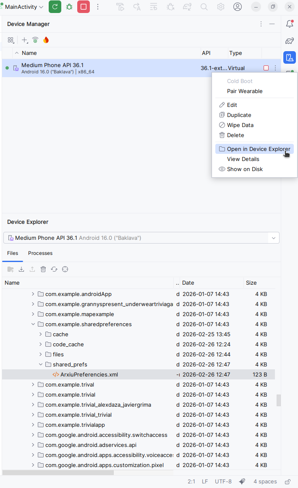
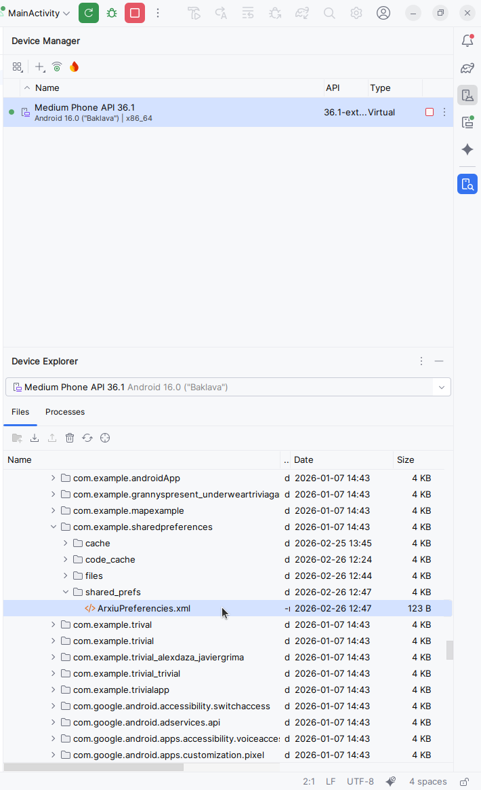
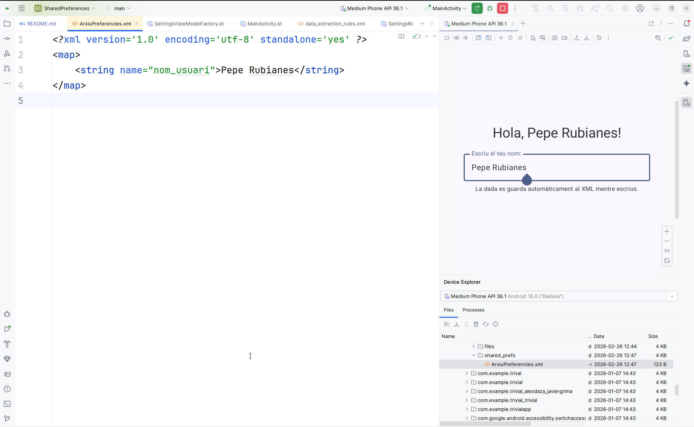

# Shared Preferences
## Purpose
The purpose of this repo is to show a demo of Shared Prefs in Android Studio with Kotlin in Jetpack Compose

## Execution view

## Open Device HD

## Shared Prefs file

## Exec view with prefs file

